# 	Towards VM Rescheduling Optimization Through Deep Reinforcement Learning
Contact: Xianzhong Ding (xding5@ucmerced.edu), Yunkai Zhang (yunkai_zhang@berkeley.edu)
### Citation
If you find this repo useful, please consider citing our paper :)

```
@inproceedings{ding2025VMR2L,
  title={Towards VM Rescheduling Optimization Through Deep Reinforcement Learning},
  author={Xianzhong Ding and Yunkai Zhang and Binbin Chen and Donghao Ying and Tieying Zhang and Jianjun Chen and Lei Zhang and Alberto Cerpa and Wan Du},
  booktitle={European Conference on Computer Systems},
  year={2025},
}
```

## Table of Contents
1. [Background](#background)
   - [What is VM Scheduling and Rescheduling?](#what-is-vm-scheduling-and-rescheduling)
   - [VM Rescheduling Details](#vm-rescheduling-details)
   - [Motivation: VM Rescheduling Latency Requirements](#motivation-vm-rescheduling-latency-requirements)
   - [Why RL?](#why-rl)
2. [Model Details](#model-details)
   - [Two-Stage Framework](#two-stage-framework)
   - [Feature Extraction with Sparse-Attention](#feature-extraction-with-sparse-attention)
   - [Risk-Seeking Evaluation](#risk-seeking-evaluation)
3. [Experiments](#experiments)
4. [Installation Instructions](#installation-instructions)
5. [Run Instructions](#run-instructions)
6. [Environments](#environments)

## Background
Modern industry-scale data centers receive many virtual machine (VM) requests per minute.

### What is VM Scheduling and Rescheduling?
<div align="center">
  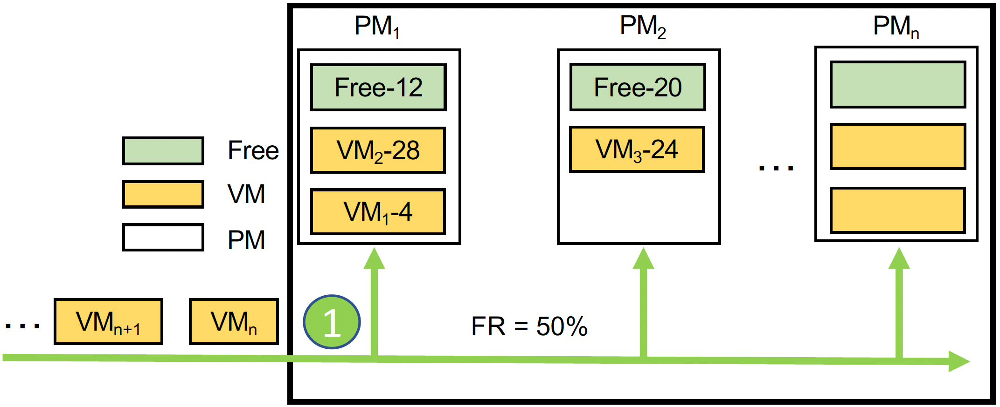

When a new VM request comes in, the VM scheduling algorithm decides which PM to host the incoming VM.
</div>

<div align="center">
  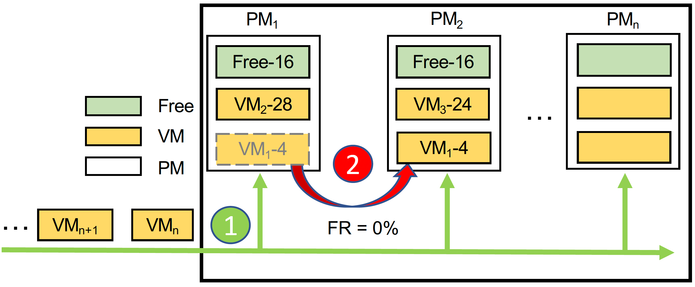

VM rescheduling reassigns a VM that is already deployed onto a new destination PM.

</div>

<div align="center">
  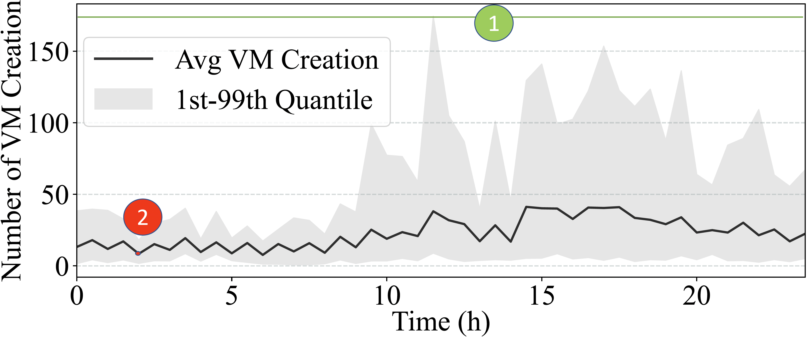
</div>

The above figure shows the maximum number of VMs changes (VMs arriving and exiting) per minute averaged over a 30-day period of a 
cluster from our in-house data center.

VM scheduling algorithm needs to be run throughout the day, so it must be able to
handle a level of workload indicated by the green line. We mostly run rescheduling during off-peak hours, so it
has to handle a lower level of workload (red dot).

### VM Rescheduling Details
   - Each cluster has no more than a few hundreds PMs, which allows for tailored configuration, 
improved fault isolation, and easier management for different user groups. In most cases, VMs can only be rescheduled within the same cluster.
   - Since most data centers manage VMs with compute-storage separation (i.e., using cloud disks), rescheduling can be performed via hot migration, which only requires copying memory information and thus incurs low overhead.
   - VM rescheduling is primarily applied to clusters that host EC2 instances, which often run for extended periods—hours or even days. Early morning rescheduling avoids disrupting many shorter tasks, as most created during the day would have already exited. Other tasks such as CI/CD or CronJob are also more short-lived and are managed in separate clusters via K8s, where rescheduling is unnecessary.
   - For system stability, a migration number limit (MNL) is set to control the number of VMs to migrate and is typically chosen to be two to three percent of all VMs.


### Motivation: VM Rescheduling Latency Requirements
<div align="center">
  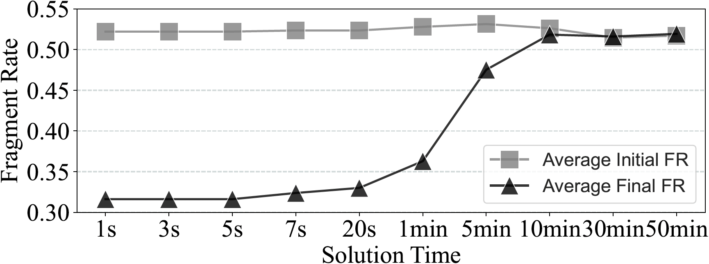
</div>

However, VM rescheduling still requires a high latency. MIP can give us the near-optimal solution, but it can take an hour to do so. 
As VMs and PMs are dynamically changing, its solution will no longer be valid after so long.

* What if the MIP solution can be returned in a shorter period of time? 

We see that if the solution can be returned in five seconds, most rescheduling actions remain optimal
and there is only marginal sacrifice in FR. However, many actions quickly become invalid once the solution
time goes above **five seconds**.

Therefore, **five seconds** is the latency requirement we look for when we choose a rescheduling algorithm.

### Why RL?

-  Supervised learning requires many correct labels, but they are expensive to obtain and requires
the model to output all rescheduling actions at once, which causes the output space to explode.
-  Heuristic models require manual feature engineering if the data distribution changes.
-  Search-based and exact models are slow at inference time.
-  Deep RL extracts features automatically. It can generalize to new scenarios that it has not been trained on.
- More importantly, we can cheaply simulate the rescheduling actions as there are **no environment uncertainties**! 
This means we can let our agent cheaply interact with the environment as much as it wants.

## Model Details
<div align="center">
  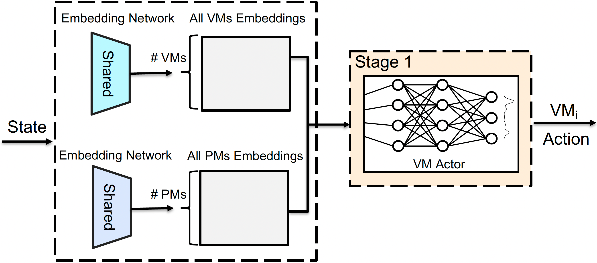
  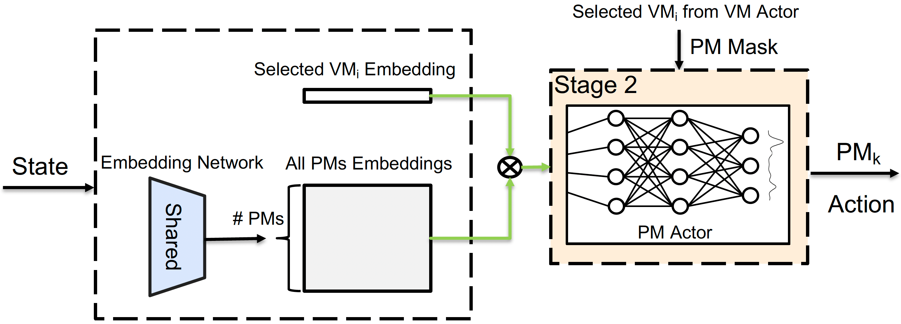
</div>

### Two-Stage Framework

- A VM request starts an episode. The action at each step in the episode is to migrate one VM.
For example, if the model is allowed to reschedule 50 VMs, we let the model take 50 actions.

- At each time step, the action is a two-tuple -- the VM to be rescheduled and its new destination PM.
We design a two-stage agent, where the model chooses the VM in the first stage and then selects a destination
PM in the second stage.

- *First stage:* a VM actor embeds all VMs and PMs via two shared embedding networks, based on which it selects a candidate VM.
*Second stage:* once a candidate VM is selected, VMR2L can efficiently mask out all the PMs that cannot host the candidate VM. The PM actor only has access to the embedding of the selected VM, instead of all VMs. PM actor then selects an appropriate destination PM from the remaining PMs.

- Benefit: once a VM is selected, we can mask out all the illegal PMs in order
to satisfy various service constraints (e.g., resource available, affinity level).

<div align="center">
  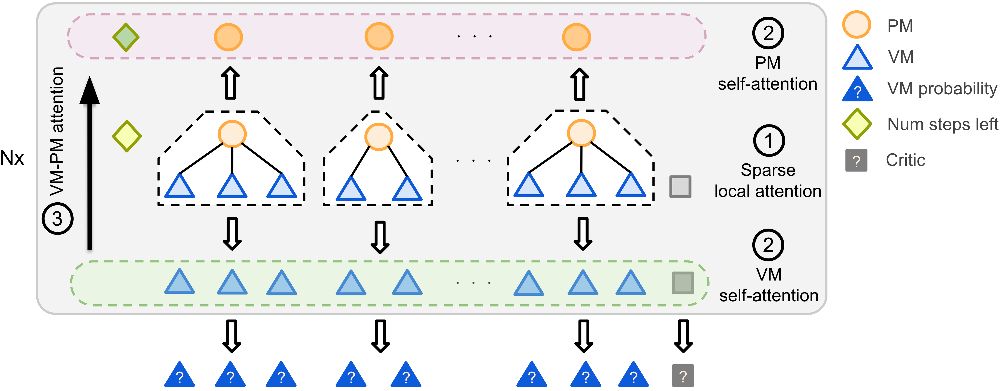
</div>

### Feature Extraction with Sparse-Attention
- We use an attention-based model as the backbone as 
its number of learnable parameters is independent of the number of VMs and PMs. 

- We design a tree-level *sparse-attention* module to allow each VM/PM to exchange information
with other machines under the same PM. This affiliation information is critical for VM rescheduling
but is absent in vanilla attention.

### Risk-Seeking Evaluation

- Since we can exactly simulate the effect of VMR actions, we can sample multiple trajectories 
during inference time, and only deploy the one with the highest reward.
- Actions with low probabilities are likely to be suboptimal, and we should avoid them during inference!

## Experiments
<div align="center">
  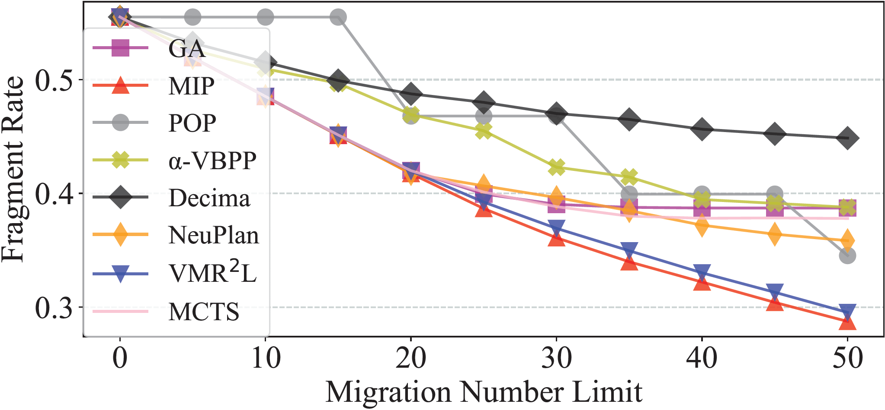
  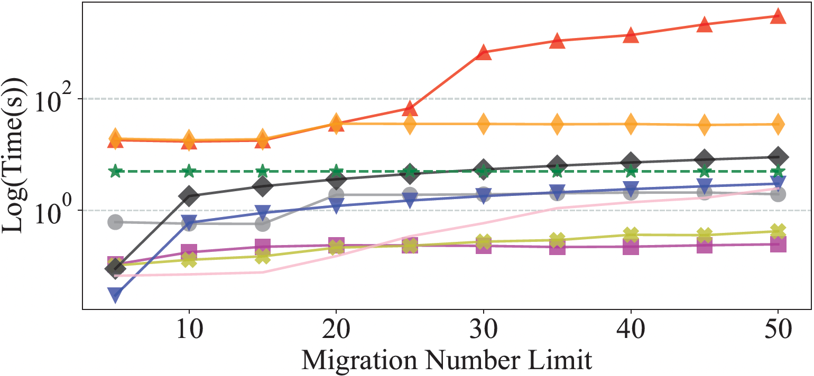

VMR2L beats all baselines under the five-second latency constraint.
</div>

<div align="center">
  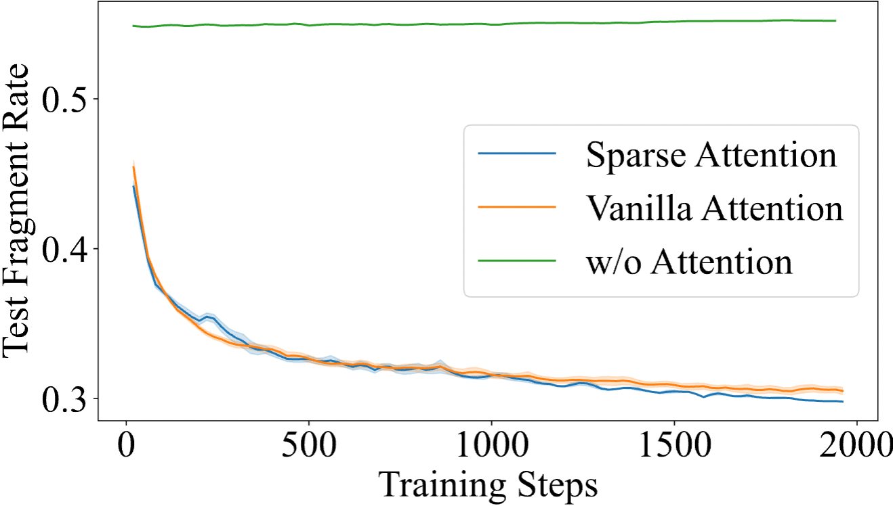
  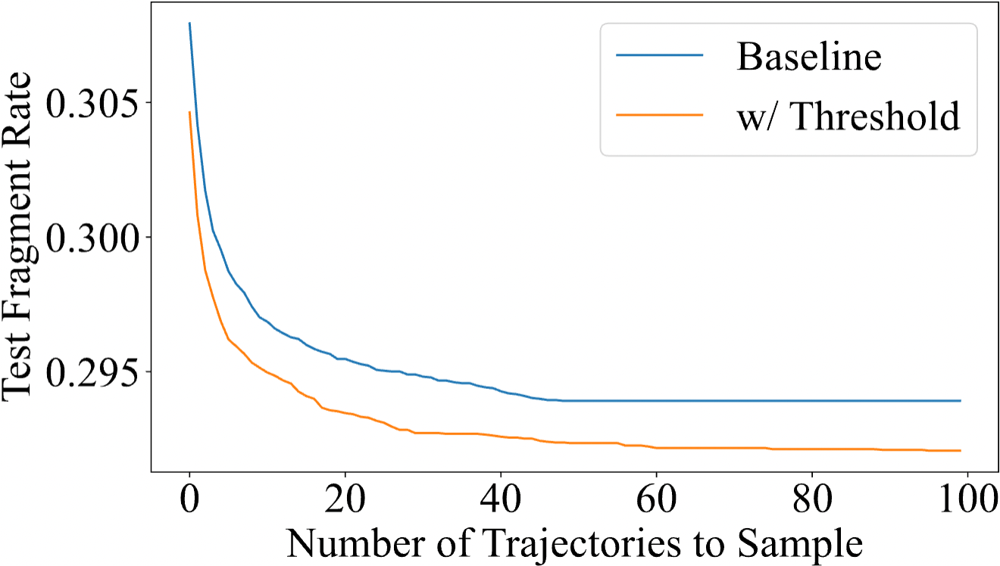

Ablation studies: sparse attention (left), risk-seeking evaluation (right).
</div>

<div align="center">
  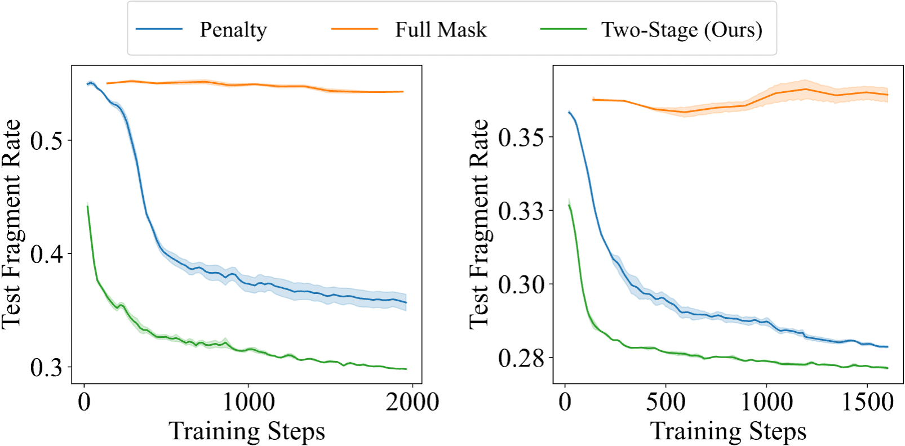

Two-stage design allows VMR2L to handle *different constraints*.
</div>


<div align="center">
  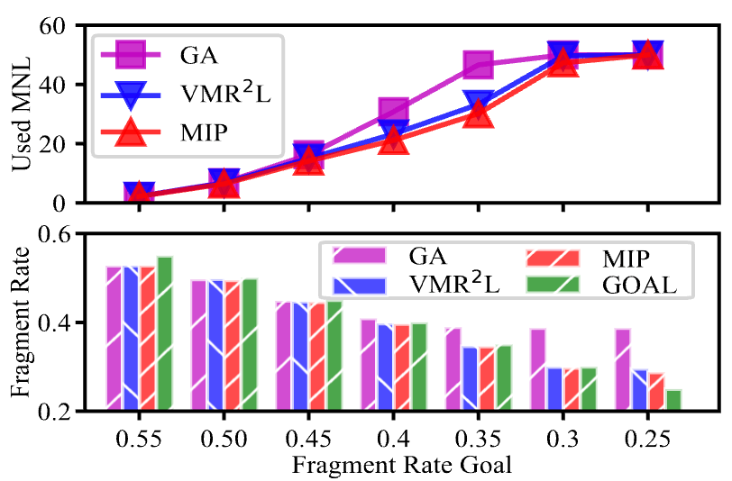

VMR2L can generalize to different objectives, such as reaching a FR level with the minimal number of VM
migrations.
</div>


<div align="center">

  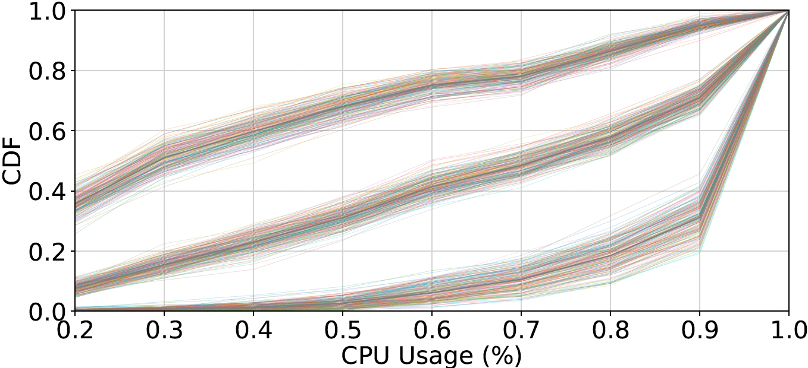
  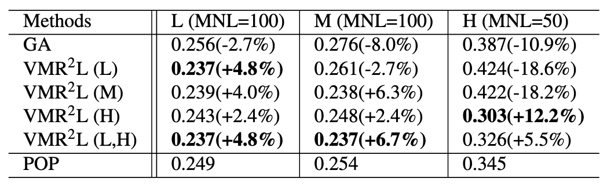

VMR2L can generalize to abnormal workload levels. Even when some workload levels are not present
during training, as long as we have trained on a higher workload (or preferably a lower one too),
we can cover those gaps!
</div>

<div align="center">
  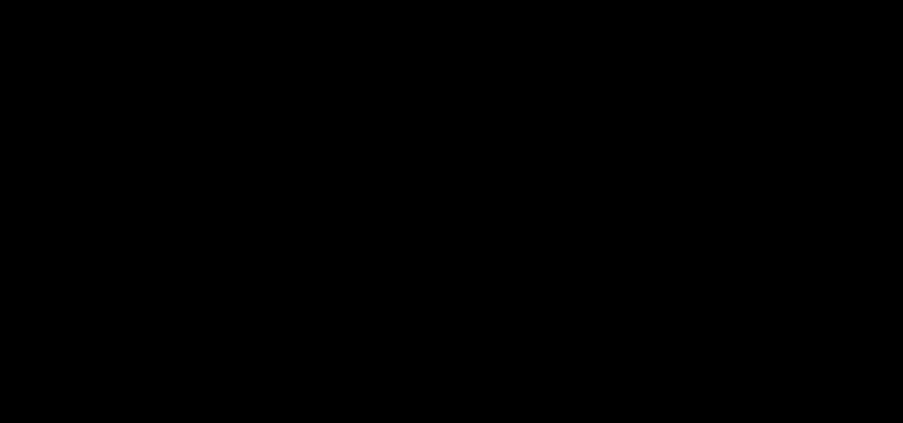
A visualization of the learned rescheduling policy. It can be generated using eval_plot_steps.py (see below).
</div>

## Installation Instructions

1. Install conda:

```
$ conda create -n vm python=3.7
$ conda activate vm
```

2. rllib:

```
$ pip install gym==0.23.1
$ pip install "ray[rllib]" tensorflow torch
$ pip install -e gym-reschdule_combination
$ pip install tqdm matplotlib pandas wandb
```

3. Obtain datasets from [Google Drive](https://drive.google.com/drive/folders/1sCK9g_vldbaaOGGFPGJ8ztK4tTFwwTH5?usp=sharing).
Unzip them under ./data/flex_vm_dataset.

4. Optional:
```
$ conda install -c dglteam dgl-cuda11.3
```

### Run instructions

- To train base VMR2L, see a list of environments under 'Environments':
```
$ python3 main.py --gym-id generalizer-v2 --vm-data-size [M/multi/M_small/M_medium]
```
- To train VMR2L with ultra attention:
```
$ python3 ultra-attn.py --gym-id graph-v2 --vm-data-size [M/multi/M_small/M_medium]
```
- To use wandb, first get your [API key](https://wandb.ai/authorize) from wandb and then add an additional --track argument:
```
$ wandb login
$ python3 main.py --track
```
- Evaluation
```
$ python3 eval.py --restore-name [] --restore-file [best/latest]
```
- To visualize the migration actions, run the command below and find your *.gif's under ./runs/[restore-name]
```
$ python3 eval_plot_steps.py --restore-name [] --restore-file [best/latest] --gym-id generalizer-v3
```
- We included some trained weights, so you can directly evaluate/visualize them. For sparse-attention,
```
$ python3 eval_sparse.py --restore-name sparse --restore-file best --gym-id graph-v2
```
For base models,
```
$ python3 eval.py --restore-name base --restore-file best --gym-id generalizer-v2
```

## Environments
* generalizer-v2: Base version.
* generalizer-v3: Base version + additional details for plots.
* affinity-v0: Consider constraints in the form of service anti-affinity.
* graph-v2: Sparse attention version.
* penalty_v0: penalize illegal actions instead of masking for models without sparse attention.
